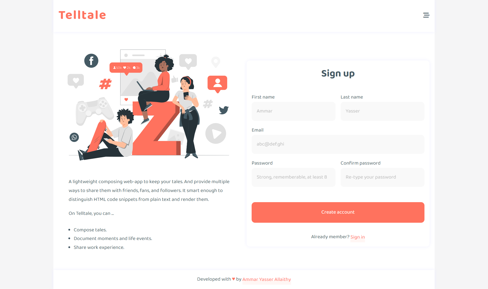
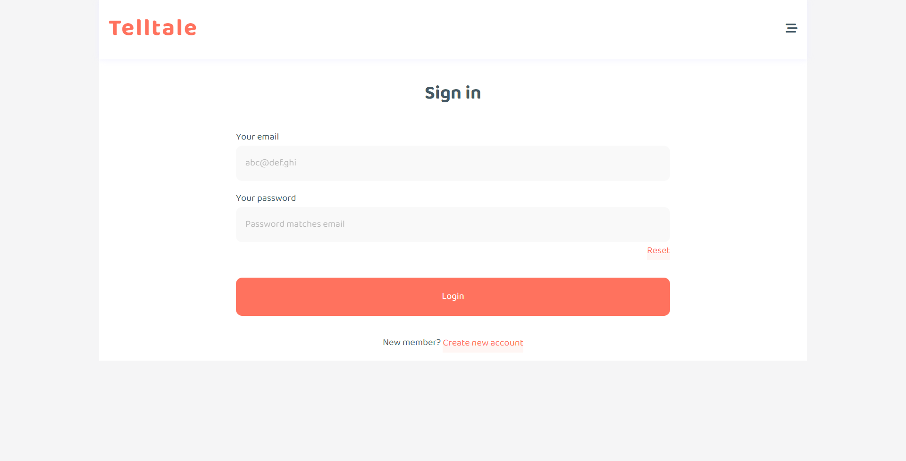
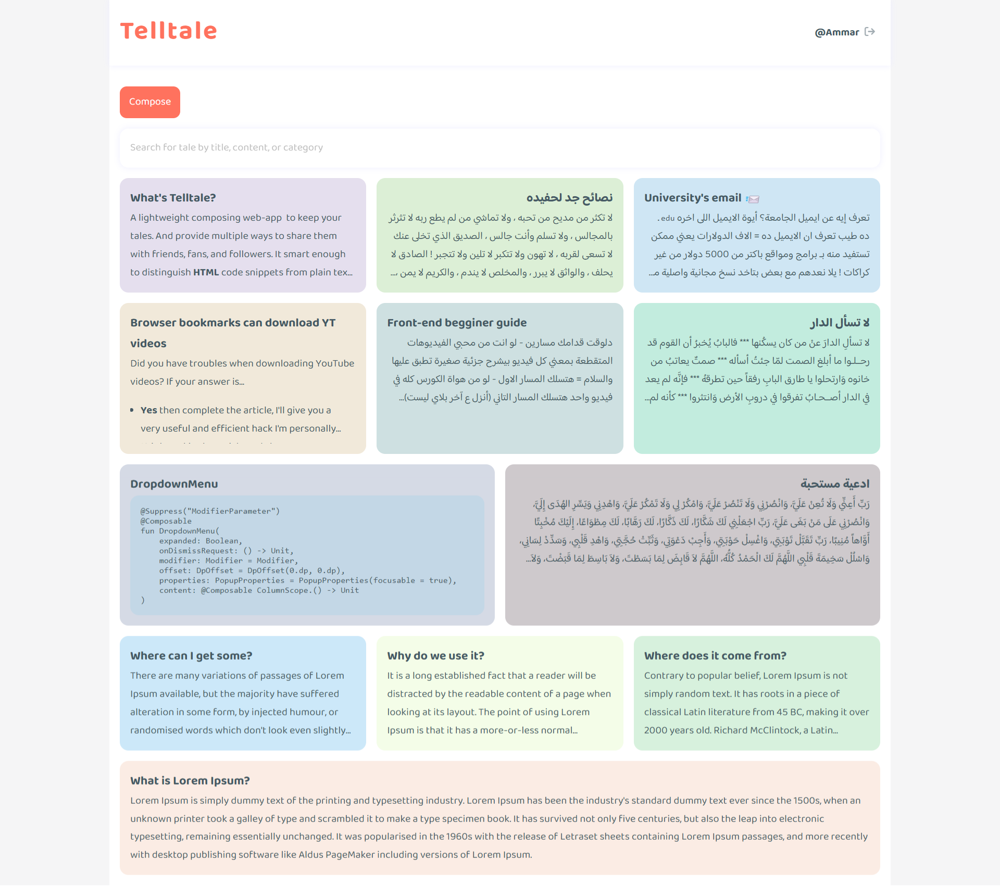
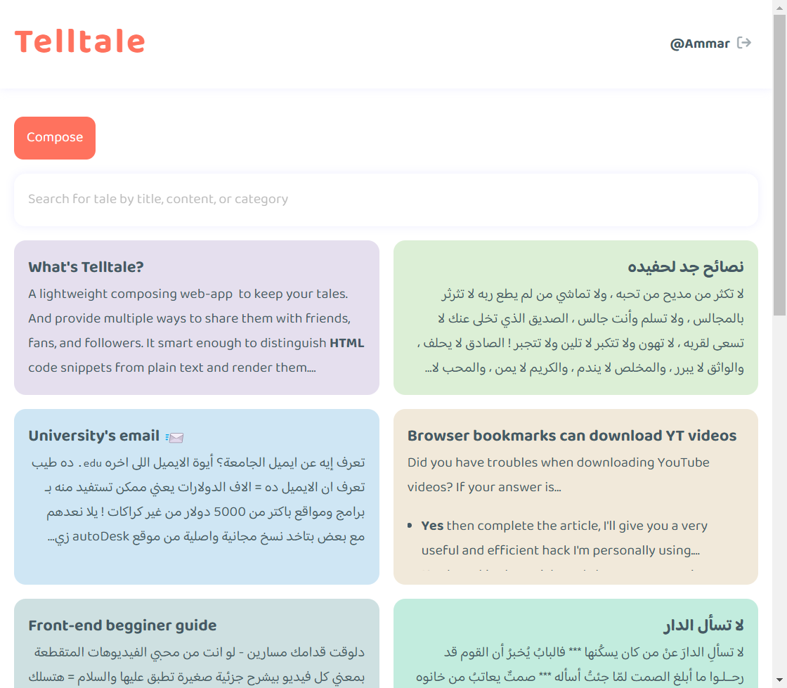
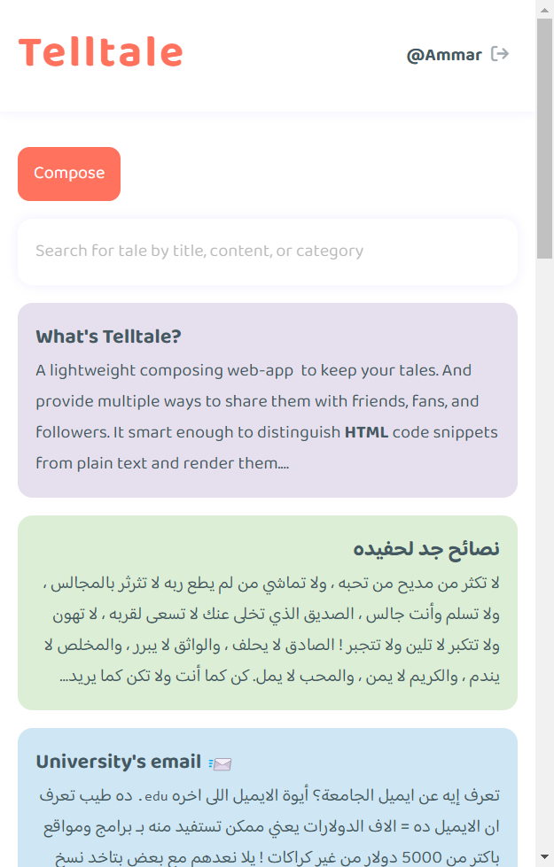
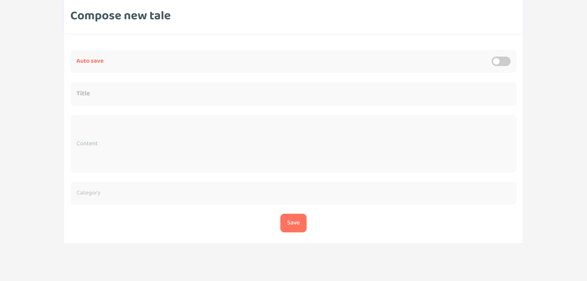
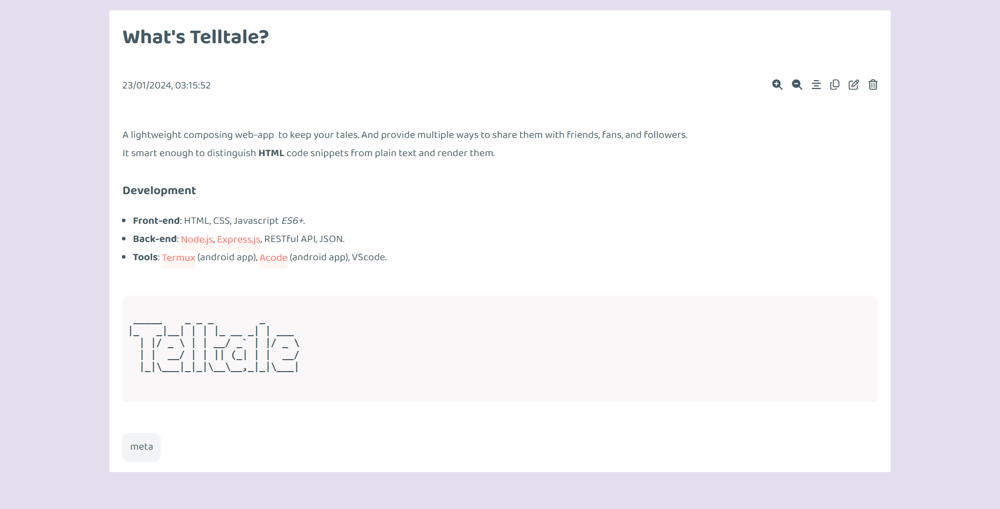
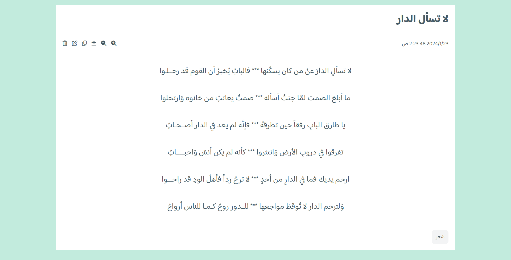
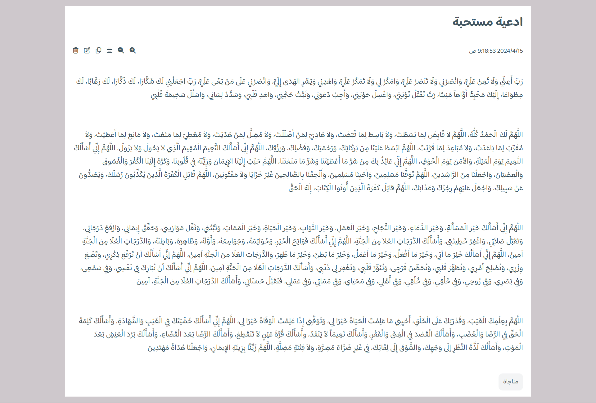
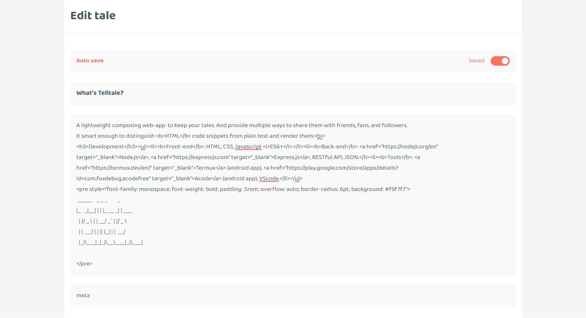

# Telltale client es

> _This module is a part the telltale project which contains 2 other modules: [telltale-server](), [telltale-client-nodejs]()_

## About

A lightweight composing and free writing web-app that keeps your tales. And provide multiple ways to share them with friends, fans, and followers.
It's smart enough to distinguish HTML code snippets from plain text and render them. It also has a responsive UI that pre-designed to best fit with all screens.

Using telltale, you can ...

- Tell tales. _(You aren't a dead man, right?)_ 😂
- Document moments and life events.
- Share work experience.

in a free and rich-text way.

## Development

- **Front-end**: HTML, CSS, Javascript _(ES6+)_, [arkit.js](https://github.com/AmmarYasserAllaithy/arkit.js)
- **Back-end**: [Node.js](https://nodejs.org/en), [Express.js](https://expressjs.com), RESTful API, JSON.
- **Tools**: [Termux](https://termux.dev/en/) _(android app)_, [Acode](https://play.google.com/store/apps/details?id=com.foxdebug.acodefree) _(android app)_, VScode.

## User interface (UI)

Landing page

Sign in

User tales _(Wide screen)_

User tales _(Medium screen)_

User tales _(Narrow screen)_

Composer _(auto-save disabled by default)_

Tale details _(HTML parsing)_

Tale details _(Centered & maximized font)_

Tale details _(Arabic characters / Long screenshot)_

Composer _(in edit mode + auto-save)_

